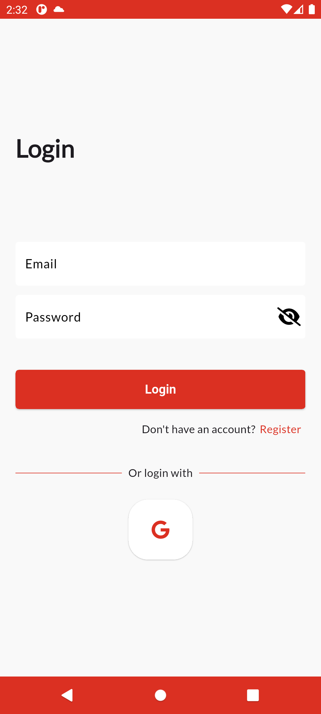
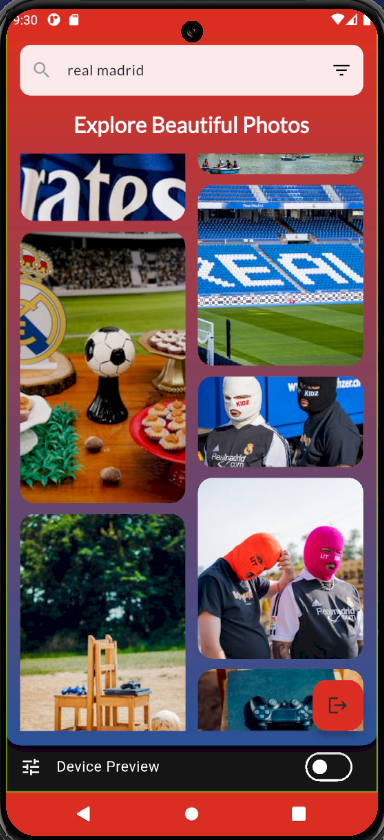
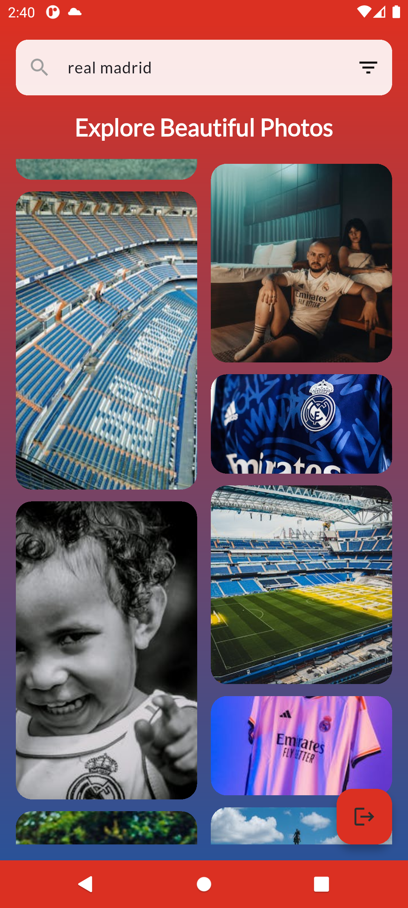
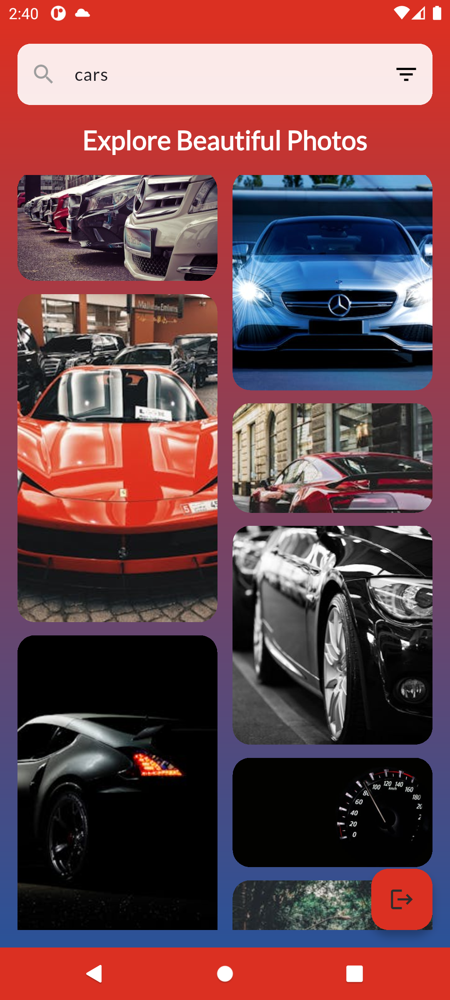
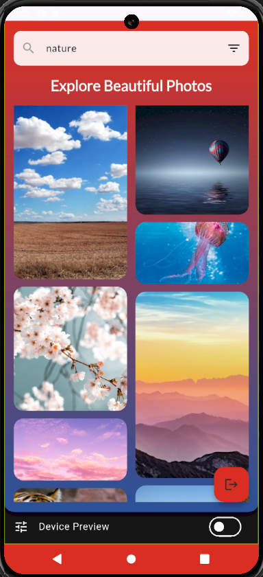
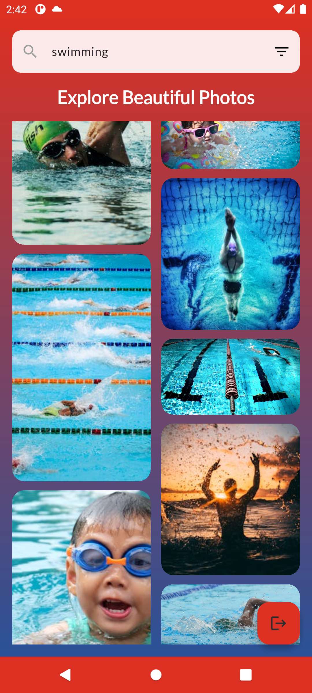
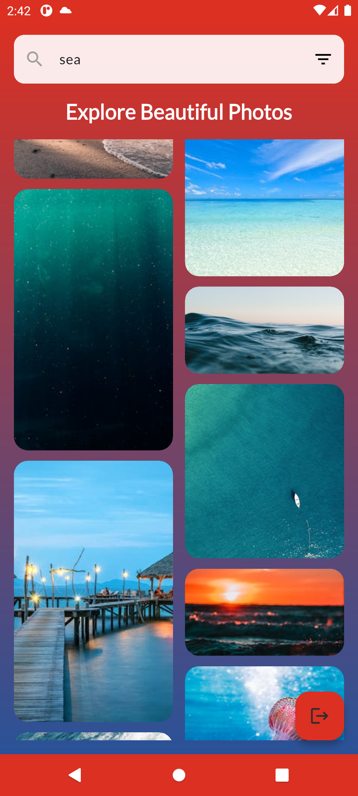

Absolutely—here's an enhanced version of your README with the additions for **pagination**, **search debouncing**, and **state management details (Riverpod for Auth, Bloc for Home)** woven in naturally:

---

# PixelsApp - The Ultimate Photo Exploration Experience 📸✨

  

## 🎥 App Showcase

### 🎮 Video Demonstration  
[🎥 Witness the Magic in Action](https://drive.google.com/file/d/16sI8XDlAtE9PfuDCSgLXjHaeD0p0ZYLH/view?usp=sharing)  
*Prepare to be dazzled by a flawless demo of PixelsApp’s silky-smooth performance.*

### 📱 Screenshots  
<p align="center">
  
  
  
  
  
  
  
</p>  
*These aren’t just screenshots—they’re windows into a masterpiece of design and functionality.*

## 🚀 Project Overview

Welcome to **PixelsApp**, a Flutter-powered marvel that redefines how users explore and interact with breathtaking photography. Integrated with the **Pexels API**, this app delivers a universe of curated and searchable images with unparalleled elegance and efficiency. From seamless authentication to a dynamic photo grid, PixelsApp is the pinnacle of mobile app craftsmanship—a testament to innovation, artistry, and technical brilliance.

### 🔑 Key Highlights
- 📸 **Curated Photo Gallery**: Dive into an endless stream of handpicked, jaw-dropping images.
- 🔍 **Smart Search with Debouncing**: Enjoy fast, efficient searches without unnecessary API calls—thanks to intelligent input debouncing.
- 📥 **Effortless Pagination**: Smoothly load more photos as you scroll, powered by robust infinite scrolling mechanics.
- 🎨 **Advanced Filtering**: Tailor your experience with orientation, size, and color options—because perfection is in the details.
- 🔐 **Firebase Authentication**: Secure, blazing-fast login with email/password and Google Sign-In.
- 🖼️ **Stunning UI**: A responsive, visually mesmerizing interface that adapts to every screen.
- ⚡ **Real-Time Data**: Powered by Dio, delivering live updates from the Pexels API with zero lag.
- 🧠 **State Management Mastery**: Authentication handled with Riverpod; Home features crafted using Bloc—ensuring modularity, scalability, and a seamless user experience.
- 💎 **Clean Code Nirvana**: Architected with precision, scalability, and maintainability in mind.

## 🛋️ Technical Specifications

| Aspect                | Details                          |
|-----------------------|----------------------------------|
| **Framework**         | Flutter - The King of Cross-Platform |
| **State Management**  | Riverpod (Auth) & Bloc (Home) - A Dynamic Duo |
| **Architecture**      | MVVM - Pure Genius |
| **API Handling**      | Dio - Speed Meets Reliability   |
| **Pagination**        | Infinite Scrolling - Lazy Load Like a Pro |
| **Search Optimization** | Debouncing - Smooth & Efficient Search |
| **Data Source**       | [Pexels API](https://www.pexels.com/api/) - A Visual Treasure Trove |
| **Authentication**    | Firebase Auth - Fort Knox Security |
| **Dependency Injection** | GetIt - Elegant and Effortless |
| **UI Enhancements**   | Shimmer, Cached Network Image, Staggered Grid - Perfection in Motion |

## ✨ Features That Steal the Show

- 📸 **Curated Photo Discovery**: Scroll through a gallery that feels like an art exhibit.
- 🔎 **Intelligent Search with Debounce**: Instant yet optimized search queries reduce API overload and enhance UX.
- 📥 **Infinite Pagination**: Load new images automatically as you scroll—because nobody likes a "Load More" button.
- 🎨 **Filter Wizardry**: Orientation, size, color—customize your visual journey.
- 🔐 **Robust Authentication**: Email, password, or Google—sign in with style and security.
- 🧠 **State Management Excellence**: Riverpod brings reactive simplicity to Auth; Bloc adds structured power to the Home screen.
- 🌟 **Responsive Design**: Flawless on any device, from phones to tablets.
- ⚡ **Real-Time Updates**: Fresh photos delivered instantly via Pexels API.
- 🖌️ **UI/UX Excellence**: A feast for the eyes with smooth animations and intuitive navigation.

## 🛠️ Getting Started

### Prerequisites
- Flutter SDK (Your gateway to greatness)
- Dart SDK (The language of champions)
- Android Studio or VS Code (Tools for a visionary)

### Installation
1. Clone this masterpiece:
   ```bash
   git clone https://github.com/Maheresio/pixels_app.git
   ```
2. Install dependencies like a pro:
   ```bash
   flutter pub get
   ```
3. Launch the app and bask in its glory:
   ```bash
   flutter run
   ```

*Pro Tip: Add your Pexels API key to a `.env` file for instant access to photo paradise.*

## 🤝 Technology Stack & Dependencies
- **Flutter**: The ultimate framework for pixel-perfect apps.
- **Dart**: Code that’s poetry in motion.
- **Riverpod (Auth)**: Clean, reactive, and powerful for authentication flow.
- **Bloc (Home)**: Structured and scalable logic for complex UI interactions.
- **Dio**: API calls faster than a speeding bullet.
- **Firebase Auth**: Security that’s tougher than titanium.
- **Google Sign-In**: Seamless social login integration.
- **Cached Network Image**: Images load like magic.
- **Shimmer**: Loading effects that dazzle.
- **Flutter Staggered Grid View**: A grid layout that’s pure eye candy.
- **Google Fonts**: Typography that elevates the soul.
- **Go Router**: Navigation so slick it’s futuristic.

## 🤝 About the Developer

Crafted by [Your Name], a Flutter virtuoso and mobile development maestro. With PixelsApp, I’ve unleashed a symphony of code, design, and innovation. My skills shine through in:
- **API Integration**: Pexels API tamed with surgical precision.
- **Clean Architecture**: MVVM executed with the elegance of a grandmaster.
- **State Management**: Riverpod and Bloc wielded like a dual-blade katana.
- **Pagination & Debouncing**: Performance-boosting mechanics integrated seamlessly.
- **UI/UX Optimization**: A visual experience that’s borderline addictive.
- **Code Craftsmanship**: Clean, scalable, and worthy of legend.

## 🎨 Design Inspiration
Inspired by the infinite beauty of photography and the limitless potential of Flutter, PixelsApp boasts a custom UI that’s sleek, modern, and unforgettable. Every pixel is placed with purpose, every transition a work of art.

## 💪 Acknowledgments
- Flutter Team: For building the canvas of my dreams.
- Pexels API: For fueling this visual odyssey.
- Firebase Crew: For security that’s rock-solid.
- Open-Source Titans: Your packages are the wind beneath my wings.

## 🙏 Contributing
Join the revolution! Contributions, issues, and feature requests are welcomed with open arms. Dive into the [issues page](https://github.com/maheresio/pixels_app/issues) and let’s make history together.
